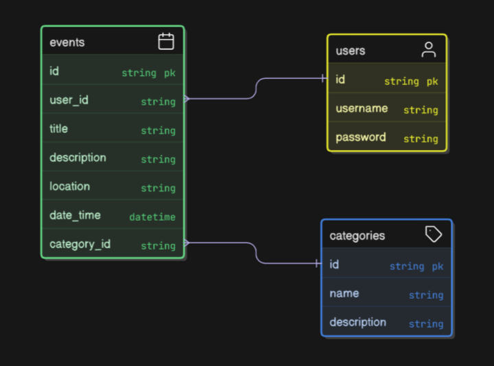
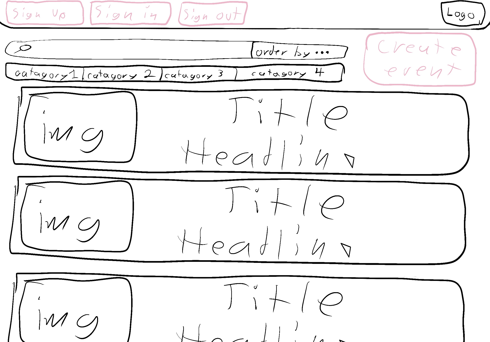
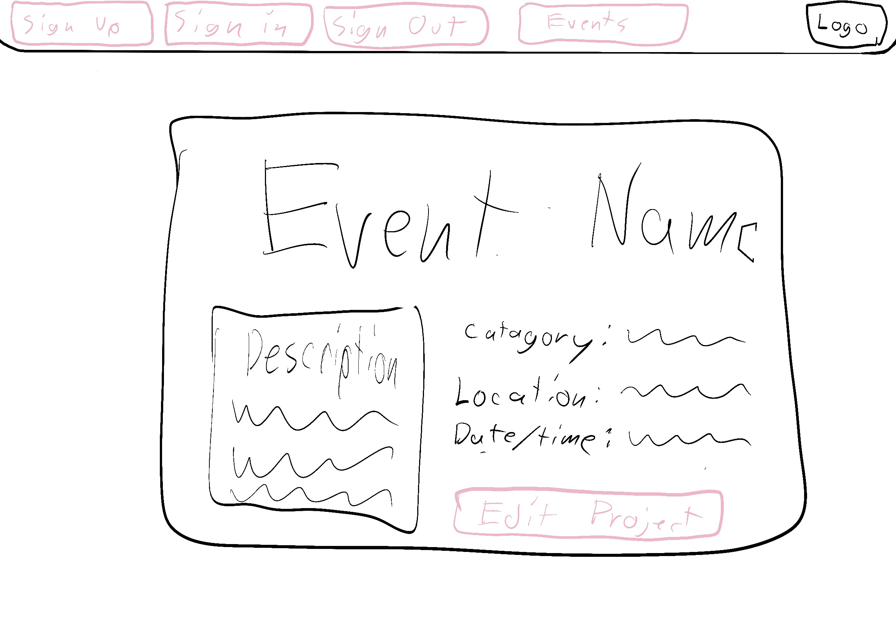
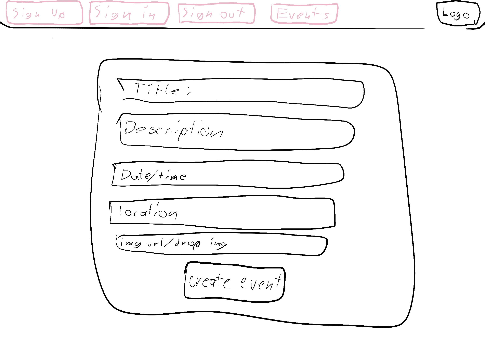
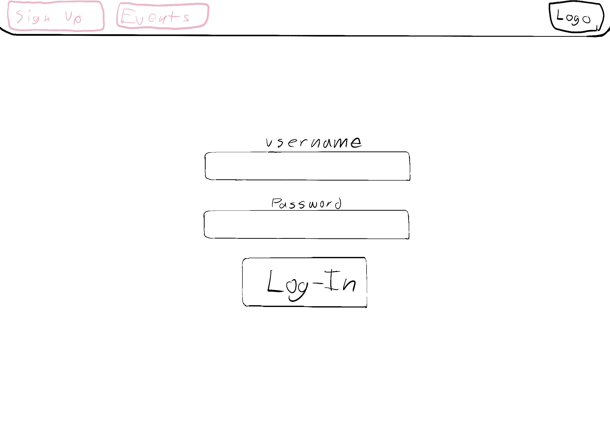
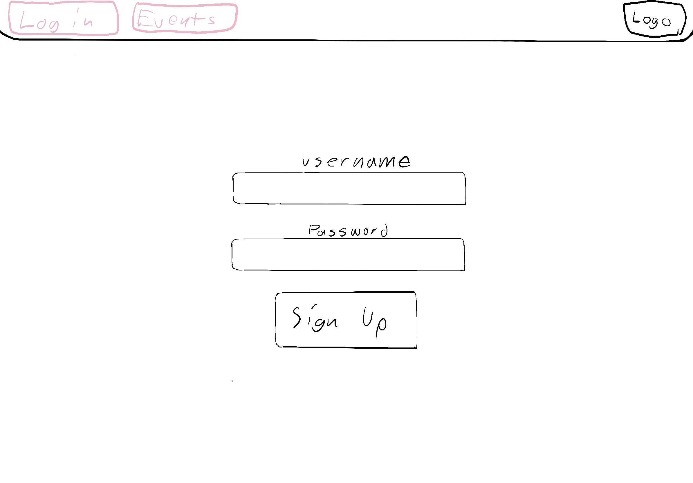

# Project Description

## Nakameet

Nakameet is a full-stack CRUD application designed to help locals discover and share community events happening nearby — from concerts and open mics to bar crawls, volunteer opportunities, and more.
The platform empowers users to create, explore, and manage event listings. Events are sourced from the community, meaning anyone can contribute to building the calendar. This creates a dynamic, inclusive space for discovering what’s happening in your area.
Whether you're planning a small fundraiser or looking for something fun to do this weekend, this app brings the community closer through shared experiences.

## MVP (Minimum Viable Product) User Stories

1. Authentication
   - As a user, I want to create an account so I can post and manage my events.
   - As a user, I want to browse public events without logging in, but need to log in to create or edit posts.
2. User Interface
   - As a user, I want to create an event by entering details like title, date, time, location, category, description, and image.
   - As a user, I want to view a list of all upcoming events, filtered by category (e.g. free, music, service, nightlife).
   - As a user, I want to update/edit an event I created if details change.
   - As a user, I want to delete an event I created if it’s canceled.
   - As a user, I want to search and filter events by date, type, or neighborhood so I can find things I’m interested in.

## Stretch Goals (Future Enhancements)

- See who else is interested or going.
- Incorporate a RSVP option.
- Featured events or editor’s picks on the homepage.
- Display events on a map using Google Maps or Leaflet.js.
- Let admins approve flagged content or feature verified events.
- Let users bookmark events they want to attend.
- Notify users about upcoming events they’re interested in.

# Timeline - Daily Accountability

| Day       |     | Task                                                          | Blockers | Notes/ Thoughts |
| --------- | --- | ------------------------------------------------------------- | -------- | --------------- |
| Monday    |     | Create timeline, team guidelines, ERD, proposal, wirefram, US |          |                 |
| Tuesday   |     | Work on back-end/ Postman/ routes                             |          |                 |
| Wednesday |     | Work on front-end                                             |          |                 |
| Thursday  |     | Work on functionaility                                        |          |                 |
| Friday    |     | Work on CSS, add one or two stretch goals, deploy app, Heroku |          |                 |
| Saturday  |     | Improve CSS, work with Alex during OO on errors               |          |                 |
| Monday    |     | Present Project to class                                      |          |                 |

---

## ERD

## 

## WireFrame

## 

## 

## 

## 

## 

## Routes

| Method   | Path               | Component        | Description                               |
| -------- | ------------------ | ---------------- | ----------------------------------------- |
| `GET`    | `/`                | `Home.jsx`       | Public landing page                       |
| `GET`    | `/login`           | `Login.jsx`      | Display login form                        |
| `POST`   | `/login`           | `Login.jsx`      | Submits login credentials                 |
| `GET`    | `/register`        | `Register.jsx`   | Display registration form                 |
| `POST`   | `/register`        | `Register.jsx`   | Submits new user data                     |
| `POST`   | `/logout`          | `Logout.jsx`     | Handles user logout and redirect          |
| `GET`    | `/dashboard`       | `Dashboard.jsx`  | User dashboard after login                |
| `GET`    | `/events`          | `EventIndex.jsx` | View all events                           |
| `GET`    | `/events/new`      | `EventNew.jsx`   | Form to create a new event                |
| `POST`   | `/events/new`      | `EventNew.jsx`   | Submit new event to backend               |
| `GET`    | `/events/:id`      | `EventShow.jsx`  | View specific event details               |
| `GET`    | `/events/:id/edit` | `EventEdit.jsx`  | Form to edit an existing event            |
| `PUT`    | `/events/:id/edit` | `EventEdit.jsx`  | Submit updated event details              |
| `DELETE` | `/events/:id`      | `EventShow.jsx`  | Delete event via UI (e.g., delete button) |
| `GET`    | `*`                | `NotFound.jsx`   | Fallback for undefined routes (404 page)  |
